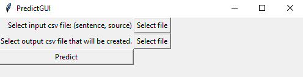
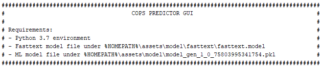

# cops-predictor-gui
Simple gui to classify new samples based on SVM model using Python's Tkinter.

Data analysis has been previously done in private. This takes this output model and makes predictions for new samples.

Categorical to numerical conversion is generated with Fasttext.

Tkinter is used to click & create style interface.

